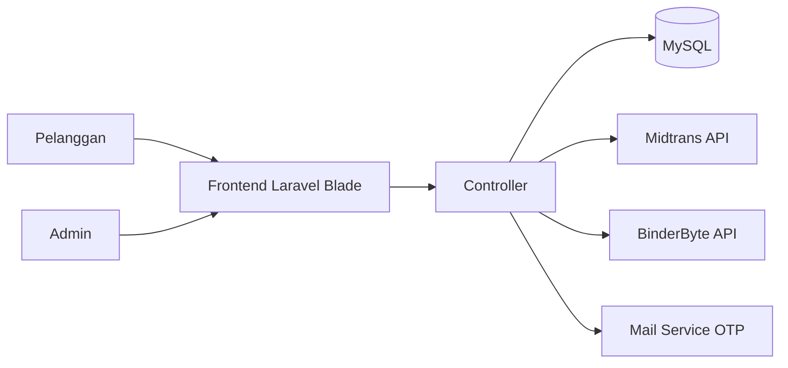
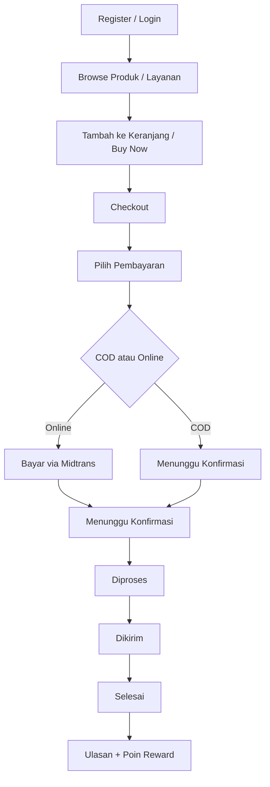

# HydroMart 2

> Sistem e-commerce Laravel untuk penjualan **produk** dan **layanan** dengan fitur checkout, pembayaran, tracking, dan reward pelanggan.

[](docs/RUNNING_GUIDE_WINDOWS.md)

---

## Tentang Sistem

HydroMart 2 dirancang untuk mendukung alur bisnis penjualan end-to-end:
- autentikasi pengguna (register, login, forgot password OTP),
- katalog produk dan layanan,
- keranjang, checkout, dan ongkir,
- pembayaran online (Midtrans) + COD,
- tracking pengiriman,
- reward poin dan penukaran reward,
- dashboard admin untuk manajemen operasional.

## Visual Arsitektur Alur



## Peta Modul Utama

| Modul | Fungsi Inti | Aktor |
|---|---|---|
| Authentication | Login, Register, OTP Reset Password | Pelanggan/Admin |
| Katalog Produk | Lihat produk, detail, ulasan | Pelanggan |
| Katalog Layanan | Lihat layanan, detail, ulasan | Pelanggan |
| Checkout & Transaksi | Checkout produk/layanan, ongkir, status order | Pelanggan |
| Payment Gateway | Pembuatan pembayaran, callback Midtrans | Sistem |
| Reward | Klaim reward dari poin, validasi masa berlaku | Pelanggan/Admin |
| Admin Panel | Kelola produk/layanan/reward/transaksi/ulasan | Admin |

## Alur Pengguna (Customer Journey)



## Peran Sistem

### Pelanggan
- Kelola akun & password.
- Belanja produk/layanan.
- Checkout dan pilih metode pembayaran.
- Pantau status transaksi dan tracking.
- Klaim reward dan lihat riwayat penukaran.

### Admin
- Kelola produk dan layanan (CRUD + soft delete/restore).
- Kelola reward.
- Validasi dan update status transaksi.
- Input resi, pantau pengiriman, balas ulasan.

## Integrasi Eksternal

- **Midtrans**: pembuatan transaksi pembayaran dan callback status pembayaran.
- **BinderByte**: validasi serta tracking resi pengiriman.
- **Mail/SMTP**: pengiriman OTP saat reset password.

## Galeri Tampilan (Tempat Screenshot)

### 1) Halaman Beranda


### 2) Halaman Detail Produk


### 3) Halaman Keranjang


### 4) Halaman Checkout


### 5) Halaman Detail Transaksi


### 6) Dashboard Admin


## Struktur Folder Penting

```text
app/Http/Controllers/
├── Auth/        # Login, register, forgot password
├── Admin/       # Manajemen data operasional
├── Pelanggan/   # Keranjang, transaksi, ulasan, reward
└── Api/         # Callback Midtrans
```

## Dokumentasi Operasional

- Panduan pull repository dan cara menjalankan di Windows:
  - [docs/RUNNING_GUIDE_WINDOWS.md](docs/RUNNING_GUIDE_WINDOWS.md)
