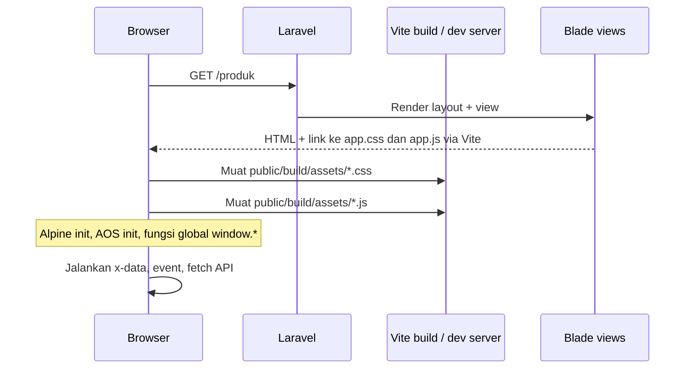
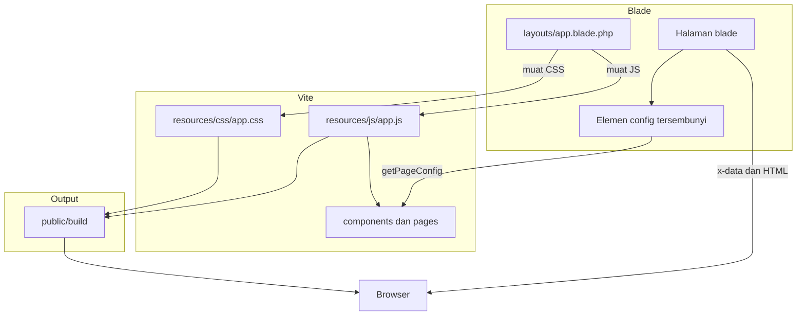

# Migrasi Frontend ke Vite — Blade, CSS, dan JavaScript

Dokumen ini menjelaskan perubahan frontend HydroMart 2 setelah CSS/JS dipindah dari CDN & inline Blade ke **Vite**, termasuk alur kerja antar file dan paket yang di-install.

---

## Daftar Isi

1. [Ringkasan Perubahan](#1-ringkasan-perubahan)
2. [Paket yang Di-install](#2-paket-yang-di-install)
3. [Alur Blade → CSS → JS](#3-alur-blade--css--js)
4. [Struktur File Baru](#4-struktur-file-baru)
5. [Per Halaman: Blade vs Vite](#5-per-halaman-blade-vs-vite)
6. [Kode Lama di Blade (HTML Comment)](#6-kode-lama-di-blade-html-comment)
7. [Cara Menjalankan](#7-cara-menjalankan)
8. [Diagram Alur](#8-diagram-alur)

---

## 1. Ringkasan Perubahan

| Sebelum | Sesudah |
|---------|---------|
| Tailwind via `cdn.tailwindcss.com` | Tailwind v4 di-build lewat `resources/css/app.css` |
| Alpine.js via CDN (dua link) | Alpine di-bundle di `resources/js/app.js` |
| AOS via CDN | Paket npm `aos` + import di `app.js` |
| `<script>` / `<style>` inline di Blade | Logika dipindah ke `resources/js/**`, CSS ke `app.css` |
| Tidak ada build step | `npm run dev` / `npm run build` → `public/build/` |

**Layout utama** memuat asset lewat:

```blade
@vite(['resources/css/app.css'])   {{-- di <head> --}}
@vite(['resources/js/app.js'])    {{-- di akhir <body> --}}
```

---

## 2. Paket yang Di-install

### Yang baru ditambahkan saat migrasi

Hanya **satu dependensi baru** yang di-install lewat npm:

| Paket | Perintah | Fungsi |
|-------|----------|--------|
| `aos` | `npm install aos --save` | Library animasi scroll (Animate On Scroll), menggantikan CDN `unpkg.com/aos` |

### Yang sudah ada di project (tidak di-install ulang)

Paket ini **sudah tercantum** di `package.json` sebelum migrasi; tidak ada perintah install tambahan untuk:

| Paket | Tipe | Fungsi |
|-------|------|--------|
| `vite` | devDependency | Bundler & dev server |
| `laravel-vite-plugin` | devDependency | Integrasi Vite ↔ Laravel (`@vite`) |
| `@tailwindcss/vite` | devDependency | Plugin Tailwind untuk Vite |
| `tailwindcss` | devDependency | Tailwind CSS v4 |
| `alpinejs` | dependency | Framework interaktif di halaman (sudah ada, sekarang dipakai dari bundle) |
| `concurrently` | devDependency | Helper menjalankan beberapa proses (jika dipakai di script composer) |

**Kesimpulan install:** yang benar-benar baru di-download saat migrasi hanya **`aos`** (+ dependensi kecilnya). Sisanya memanfaatkan stack Vite/Tailwind/Alpine yang sudah disiapkan di project.

---

## 3. Alur Blade → CSS → JS

### 3.1 Saat user membuka halaman



### 3.2 Peran masing-masing lapisan

| Lapisan | File utama | Tugas |
|---------|------------|--------|
| **Blade** | `resources/views/layouts/app.blade.php` | Struktur HTML, `@vite`, meta CSRF, `#app-config`, `@yield` / `@stack` |
| **Blade (halaman)** | `resources/views/**` | Markup Tailwind, `x-data="namaFungsi()"`, `div` config `data-config` |
| **CSS** | `resources/css/app.css` | Tailwind, AOS CSS, style global, animasi landing |
| **JS** | `resources/js/app.js` | Entry: Alpine.start, AOS.init, registrasi fungsi ke `window` |
| **JS (modul)** | `resources/js/components/*`, `pages/*` | Logika dropdown, checkout, cart, auth, dll. |
| **Output** | `public/build/` | Hasil `npm run build` (CSS/JS ter-minify, di-cache browser) |

### 3.3 Data dari PHP ke JavaScript

Blade **tidak** lagi menaruh logika JS panjang. Data dinamis dikirim lewat elemen tersembunyi:

```blade
<div id="cart-config" class="hidden" data-config='@json([...])'></div>
```

JavaScript membaca dengan `getPageConfig('cart-config')` di `resources/js/utils/helpers.js`.

Contoh lain:

| ID element | Halaman | Isi |
|------------|---------|-----|
| `app-config` | Layout | `data-base-path` untuk URL API wilayah |
| `wilayah-config` | Register, edit profil | ID provinsi/kota/kecamatan (old input) |
| `cart-config` | Keranjang | Item keranjang + URL update |
| `checkout-produk-config` | Checkout produk | mode, harga, berat, reward, ongkir |
| `checkout-layanan-config` | Checkout layanan | total, ongkir, base path |
| `pembayaran-config` | Pembayaran | expiry, URL polling status |
| `forgot-password-config` | Lupa password | URL reset |
| `reset-password-config` | Reset password | email, URL login |

---

## 4. Struktur File Baru

```text
resources/
├── css/
│   └── app.css              # Tailwind + AOS + style global + .animate-bounce-slow
└── js/
    ├── app.js               # Entry point: Alpine, AOS, window.*, init halaman
    ├── utils/
    │   └── helpers.js       # CSRF, formatCurrency, getPageConfig
    ├── components/
    │   ├── cascading-dropdown.js   # Register & profil (wilayah)
    │   └── checkout.js             # Checkout produk/layanan, ongkir, payment
    └── pages/
        ├── auth.js          # Lupa password & reset password
        ├── cart.js          # Keranjang
        ├── pembayaran.js    # Countdown & polling Midtrans
        └── reward.js        # Modal klaim reward

vite.config.js               # Input: app.css + app.js
public/build/                # Hasil build (manifest + assets)
```

### Registrasi fungsi global (`app.js`)

Alpine di Blade memanggil fungsi seperti `x-data="cartHandler()"`. Agar tetap berfungsi, fungsi didaftarkan ke `window`:

| `window.*` | Sumber modul |
|------------|----------------|
| `cascadingDropdown` | `components/cascading-dropdown.js` |
| `checkoutDropdown`, `checkoutSummary`, `paymentMethod` | `components/checkout.js` |
| `fetchOngkirAjax` | `components/checkout.js` |
| `cartHandler` | `pages/cart.js` |
| `forgotPasswordHandler`, `resetPasswordHandler` | `pages/auth.js` |
| `confirmClaim`, `closeModal` | `pages/reward.js` |
| `copyToClipboard` | `pages/pembayaran.js` |

`Alpine.start()` dipanggil setelah registrasi. `app.js` diletakkan **di akhir `<body>`** agar DOM sudah ada sebelum Alpine memproses `x-data`.

---

## 5. Per Halaman: Blade vs Vite

| Halaman | Blade (aktif) | JS/CSS aktif (Vite) |
|---------|---------------|---------------------|
| Semua halaman `@extends('layouts.app')` | Layout + `@vite` | `app.css`, `app.js` |
| Landing | HTML + `data-aos` | CSS animasi `.animate-bounce-slow` di `app.css` |
| Register / edit profil | Form + `x-data="cascadingDropdown()"` | `cascading-dropdown.js` + `#wilayah-config` |
| Keranjang | `x-data="cartHandler()"` | `cart.js` + `#cart-config` |
| Checkout produk | `checkoutSummary`, `checkoutDropdown`, `paymentMethod` | `checkout.js` + `#checkout-produk-config` |
| Checkout layanan | Sama, geofencing Jember | `checkout.js` + `#checkout-layanan-config` |
| Pembayaran | Countdown, polling | `pembayaran.js` + `#pembayaran-config` |
| Lupa / reset password | Alpine handlers | `auth.js` + config div |
| Reward index/show | `onclick="confirmClaim(...)"` | `reward.js` |

---

## 6. Kode Lama di Blade (HTML Comment)

CSS dan JS yang **sebelumnya aktif** di Blade sekarang dibungkus komentar HTML:

```html
<!--
<script>
    ... kode lama ...
</script>
-->
```

**Bukan** hanya baris catatan `{{-- dipindah ke ... --}}`, melainkan **seluruh blok kode** yang tidak dieksekusi browser.

File yang memuat komentar arsip:

- `resources/views/layouts/app.blade.php` — CDN Tailwind, Alpine, AOS, `<style>` global
- `resources/views/landing.blade.php` — `<style>` animasi bounce
- `resources/views/auth/register.blade.php`
- `resources/views/profile/edit.blade.php`
- `resources/views/auth/forgot-password.blade.php`
- `resources/views/auth/reset-password.blade.php`
- `resources/views/pelanggan/cart/index.blade.php`
- `resources/views/pelanggan/transaksi/checkout/produk/index.blade.php`
- `resources/views/pelanggan/transaksi/checkout/layanan/index.blade.php`
- `resources/views/pelanggan/transaksi/pembayaran.blade.php`
- `resources/views/pelanggan/reward/index.blade.php`
- `resources/views/pelanggan/reward/show.blade.php`

> **Catatan:** Laravel tetap bisa memproses `{{ }}` di dalam komentar HTML saat render, tetapi browser **tidak menjalankan** `<script>` di dalam `<!-- -->`.

---

## 7. Cara Menjalankan

### Development (disarankan saat mengubah CSS/JS)

```bash
npm run dev
php artisan serve
```

Vite dev server menyediakan hot reload.

### Production / tanpa dev server

```bash
npm run build
```

Lalu jalankan Laravel seperti biasa (Laragon atau `php artisan serve`). Browser memuat file dari `public/build/`.

Setelah mengubah file di `resources/css` atau `resources/js`, wajib:

- `npm run dev` (otomatis reload), atau
- `npm run build` (generate ulang `public/build/`)

Panduan lengkap Windows: [RUNNING_GUIDE_WINDOWS.md](RUNNING_GUIDE_WINDOWS.md)

---

## 8. Diagram Alur



---

## Dokumen Terkait

- [ALUR_FITUR.md](ALUR_FITUR.md) — alur bisnis aplikasi (user → controller → DB)
- [RUNNING_GUIDE_WINDOWS.md](RUNNING_GUIDE_WINDOWS.md) — setup & menjalankan project
